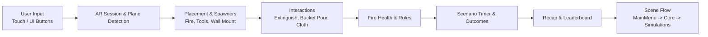

# FLARE

## Overview
- Purpose of the project: Mobile AR training for fire safety and evacuation, using interactive simulations.
- Problem it solves: Provides safe, repeatable practice for handling different fire scenarios and emergency steps.
- Key features:
  - AR plane detection and tap-to-place setup for training scenes.
  - Multiple scenarios: solid-fuel fire, LPG fire, electrical fire, and evacuation.
  - Interactive tools: extinguisher, water bucket, and cloth-based suppression.
  - Scenario rules with fail states (e.g., using water on LPG/electrical fires).
  - Timed challenges with recap and local leaderboard.
- Target users: Students, trainees, educators, and safety trainers.

## Architecture


- System components:
  - AR foundation layer: plane detection, raycasts, and camera anchoring.
  - Scenario control: level bootstrap, level loader, and countdown timer.
  - Interaction logic: tool equip/use, collision checks, fire health, and fail states.
  - UI layer: prompts, timers, recap, and leaderboard.
- Module relationships:
  - Scene flow loads the Core scene and then additive simulation scenes.
  - Bootstrap wires AR managers into placement and spawner controllers.
  - Interaction controllers feed results into fire health and timer outcomes.
  - Recap and leaderboard read saved run data and present it in UI.
- Data flow explanation:
  - User taps or UI actions trigger placement and tool usage.
  - Fire health decreases based on tool interactions and rules.
  - Timer resolves win/lose states and triggers recap flow.
  - Recap and leaderboard persist results locally and surface them in UI.

## Technology Stack
- Languages: C#
- Frameworks: Unity 6 (URP), AR Foundation
- Libraries / Packages:
  - ARCore, ARKit
  - Input System
  - TextMesh Pro, Unity UI
  - Alembic (for .abc assets)
  - Blender (for .fbx assets)
- Databases: None (uses local PlayerPrefs storage)

## Repository Structure
```
FLARE-2.0/
├─ Assets/
│  ├─ Animation/
│  ├─ Fonts/
│  ├─ Images/
│  ├─ Models/
│  ├─ Prefabs/
│  ├─ Resources/
│  ├─ Scenes/
│  ├─ Scripts/
│  ├─ Settings/
│  ├─ Shaders/
│  ├─ TextMesh Pro/
│  ├─ TutorialInfo/
│  ├─ UnityXRContent/
│  └─ XR/
├─ Packages/
├─ ProjectSettings/
├─ UserSettings/
├─ ContentPackages/
├─ Assembly-CSharp.csproj
├─ Assembly-CSharp-Editor.csproj
└─ FLARE-2.0.slnx
```

- [Assets/](Assets/): Main Unity content (scenes, scripts, prefabs, models, and UI assets).
- [Assets/Scenes/](Assets/Scenes/): Simulation and menu scenes (MainMenu, Core, Simulasi_*).
- [Assets/Scripts/](Assets/Scripts/): Gameplay, AR interaction, UI flow, and data persistence.
- [Packages/](Packages/): Unity package dependencies.
- [ProjectSettings/](ProjectSettings/): Unity project configuration and editor settings.
- [UserSettings/](UserSettings/): Local editor settings (not required for builds).
- [ContentPackages/](ContentPackages/): Local package archives used by the project.
- [Assembly-CSharp.csproj](Assembly-CSharp.csproj): Unity-generated C# project file.
- [Assembly-CSharp-Editor.csproj](Assembly-CSharp-Editor.csproj): Unity editor C# project file.
- [FLARE-2.0.slnx](FLARE-2.0.slnx): Unity solution file.
